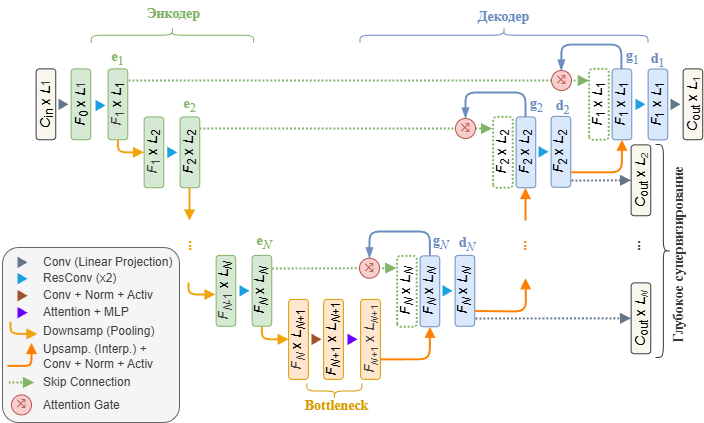

# Модель алгоритма идентификации параметров по частотным характеристикам

## Архитектура модели

Модель основана на архитектуре энкодер-декодер, состоящей из $N$-уровней и выполняющей преобразование ${C_{\text{in}}}$-канального тензора длины ${L_1}$ в ${C_{\text{out}}}$-канальный тензор той же длины:

$$\begin{equation*}
    \textbf{Y}: \quad \mathbb{R}^{C_{\text{in}} \times L_1} \mapsto \mathbb{R}^{C_{\text{out}} \times L_1}.
\end{equation*}$$

<p align="center" width="100%">
  
</p>

Количество обучаемых параметров построенной модели составляет порядка 5.3M.

Архитектура модели приведена в [TransformerBottleneck_model.py](src/models/TransformerBottleneck_model.py).

Лог обучения: в [TransformerBottleneck-model](train_logs/TransformerBottleneck-model.json).

## Даталоудер

Создан датакласс [ZerosPolesDataset.py](src/dataloaders/ZerosPolesDataset.py), наследующий от `torch.utils.data.Dataset` следующие методы:
- `__init__`: инициализация путей к данным и маскам;
- `__len__`: возврат количества примеров в датасете;
- `__getitem__`: возврат одного примера в виде `(data_tensor, masks_tensor, freq_tensor)`.

Обучение реализовано в [train.py](src/train.py) в виде класса `ModelTrainer`.

Гиперпараметры задаются в файле [TransformerBottleneck-model-config.json](src/config/TransformerBottleneck-model-config.json).

## Работа с проектом
### 1. Скачайте файлы репозитория
### 2. Скачайте датасет [zeros-poles-masks](???)
### 3. Создайте окружение в директории `.venv`
```
python -m venv .venv
```
### 4. Активируйте окружение
```
.venv\Scripts\activate
```
### 5. Установите библиотеки
```
pip install -r requirements.txt
```

### Конфигурирование проекта

Общие гиперпараметры задаются в файле [config.json](src/config/config.json), включая:
- `data_dir: str` - каталог с датасетами;
- `checkpoints_dir: str` - каталог с файлами весов моделей;
- `logs_dir: str` - каталог с логами моделей;
- `score_dir: str` - каталог с картинками обучения;
- `device: str` - `cuda`, `cpu`;
- `seed: int`.

Рекомендуется работать с моделью из терминала посредством [main.py](src/main.py).

```
python -m src.main --hypes src\config\TransformerBottleneck-model-config.json
```
или
```
python -m src.main hypes src\config\TransformerBottleneck-model-config.json --resume checkpoints\best_TransformerBottleneck-model.pth
```